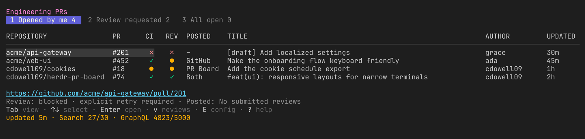

# herdr-pr-board

`herdr-pr-board` is a plugin for [Herdr](https://herdr.dev). It brings pull requests from multiple repositories and GitHub organizations into one Herdr tab.



## Terms

This document uses these technical terms:

- **PR**: A GitHub pull request.
- **View**: A named list of PRs from one GitHub search.
- **Scope**: A GitHub user, organization, or repository.
- **CI**: Continuous integration checks for a PR.

## Functions

The plugin supplies these default views:

- **Opened by me** shows each open PR that your GitHub account created.
- **Review requested** shows each open PR that requests your review.
- **All open** shows each open PR in the configured scopes.

You can add, remove, rename, or move views in `config.toml`.

The board shows the URL of the selected PR.

The CI column uses a symbol and a color:

| Symbol | Color | Meaning |
| --- | --- | --- |
| `✓` | Green | All checks passed. |
| `●` | Yellow | One or more checks are pending. |
| `✗` | Red | One or more checks failed. |
| `–` | Dim | The PR has no checks. |
| `?` | Dim | The plugin cannot get the check status. |

## Requirements

Install these tools:

- Herdr 0.8.0 or later
- GitHub CLI (`gh`)
- Go 1.24 or later

Authenticate GitHub CLI before you use the plugin:

```sh
gh auth login
```

The plugin does not store a GitHub token. GitHub CLI supplies the authentication.

## Install from GitHub

Run this command:

```sh
herdr plugin install cdowell09/herdr-pr-board
```

## Install for local development

Build and link the plugin:

```sh
go build -o bin/herdr-pr-board ./cmd/herdr-pr-board
herdr plugin link "$PWD"
```

## Open the board

Run this command:

```sh
herdr plugin action invoke open --plugin cdowell09.pr-board
```

The action opens a dedicated Herdr tab named `PR Board`. If the tab is open, the action moves focus to that tab.

You can add this key binding to `~/.config/herdr/config.toml`:

```toml
[[keys.command]]
key = "prefix+shift+b"
type = "plugin_action"
command = "cdowell09.pr-board.open"
description = "open PR board"
```

Reload the Herdr configuration:

```sh
herdr server reload-config
```

The default Herdr prefix is `Ctrl+B`. Press `Ctrl+B`, and then press `Shift+B` to open the board.

The shortcut does not replace `prefix+shift+p`. Herdr uses that shortcut to rename a pane.

## Configure the board

The first run creates this file:

```text
$(herdr plugin config-dir cdowell09.pr-board)/config.toml
```

See [`config.example.toml`](config.example.toml) for a complete example.

The default configuration has this structure:

```toml
[ui]
title = "Pull Requests"

[github]
refresh_interval = "5m"
limit_per_scope = 100
max_concurrency = 4
ci_batch_size = 25
scopes = [
  "user:@me",
  # "org:your-company",
  # "repo:owner/repository",
]

[[views]]
id = "authored"
title = "Opened by me"
query = "is:open author:@me"
scope = "global"

[[views]]
id = "review"
title = "Review requested"
query = "is:open review-requested:@me"
scope = "global"

[[views]]
id = "all"
title = "All open"
query = "is:open"
scope = "configured"
```

Each view uses a GitHub PR search query.

`scope = "global"` runs the query one time. `scope = "configured"` runs the query one time for each configured scope.

The plugin runs the scope searches at the same time. `github.max_concurrency` limits the number of Search API requests that run at the same time.

The plugin combines the scoped results. The plugin removes duplicate PR URLs.

### Settings reference

| Setting | Default | Valid values | Effect |
| --- | --- | --- | --- |
| `ui.title` | `"Pull Requests"` | A string that is not empty. | The header of the board. |
| `github.refresh_interval` | `"5m"` | `"0"` or a Go duration of `1m` or more, for example `"5m"` or `"1h"` | The time between automatic refreshes. `"0"` stops automatic refresh. |
| `github.limit_per_scope` | `100` | An integer from 1 through 1000 | The maximum number of PRs that each search query returns. |
| `github.max_concurrency` | `4` | An integer from 1 through 8 | The maximum number of Search API requests that the plugin sends at the same time across all views and scopes during a refresh. |
| `github.ci_batch_size` | `25` | An integer from 1 through 50 | The number of PRs in one GraphQL CI query. |
| `github.scopes` | `["user:@me"]` | A list that is not empty. Each entry must be `user:name`, `org:name`, or `repo:owner/name`. Each entry must be unique. | The scopes that views with `scope = "configured"` use. `@me` refers to your GitHub account. |
| `[[views]].id` | None | Lowercase letters, digits, `-`, and `_`. The ID must start with a letter. Each ID must be unique. | The ID of the view. |
| `[[views]].title` | None | A string that is not empty. | The name of the view in the board. |
| `[[views]].query` | None | A GitHub PR search that is not empty. | The PRs that the view shows. |
| `[[views]].scope` | None | `"global"` or `"configured"` | `"global"` runs the query one time. `"configured"` runs the query one time for each entry in `github.scopes`. |

When the board starts, it makes sure that the configuration is correct. If the configuration has a mistake, the board does not start. The error message gives the name of the setting that is wrong.

### Validate your configuration

Run this command to check a configuration. The command does not start the board:

```sh
bin/herdr-pr-board -config path/to/config.toml -validate
```

If the configuration is correct, the command prints `configuration is valid` and exits with code 0. If the configuration has a mistake, the command prints the problem and exits with a non-zero code. The command does not create a missing file. The command does not need GitHub CLI.

### Add a custom view

Add another `[[views]]` section:

```toml
[[views]]
id = "security"
title = "Security queue"
query = 'is:open label:"security" -is:draft'
scope = "configured"
```

Use a unique lowercase `id`. Use a GitHub PR search for `query`.

### Stop automatic refresh

Set the refresh interval to zero:

```toml
[github]
refresh_interval = "0"
```

## Use the board

| Key | Action |
| --- | --- |
| Left click a view | Select the view. |
| Left click a PR | Select the PR. |
| Left click the URL | Open the PR in a browser. |
| Mouse wheel | Move through the PR list. |
| `1`–`9` | Select a view. |
| `Tab` | Select the next view. |
| `Shift+Tab` | Select the previous view. |
| `j`, `k`, arrow keys | Select a PR. |
| `/` | Filter the active view. |
| `Esc` | Clear the filter. |
| `r` | Refresh the active view. |
| `R` | Refresh all views. |
| `Enter`, `o` | Open the selected PR in a browser. |
| `q` | Close the board. |

If the operating system cannot open the browser, the board keeps the selected URL visible. It reports the failure at the bottom of the screen.

## API limits

The plugin refreshes the board when it starts. The default automatic refresh interval is five minutes.

GitHub permits 30 authenticated Search API requests each minute. GitHub returns a maximum of 1,000 results for each search.

The plugin runs view and scope searches at the same time. `github.max_concurrency` limits the concurrent Search API requests. The plugin removes duplicate PRs before it requests CI data.

The plugin gets CI data with batched GraphQL queries. GitHub gives an authenticated user 5,000 GraphQL points each hour.

The board shows the remaining Search API and GraphQL capacity. The board keeps old data when a refresh fails.

The footer reports when the active view last refreshed successfully. A failed refresh does not advance that time. When a refresh fails and the board keeps old data, the view is marked `stale` in the footer and a `stale` notice above the table counts the retained rows until a refresh succeeds.

## Troubleshooting and plugin lifecycle

See [`docs/troubleshooting.md`](docs/troubleshooting.md) for help with common failures. It also explains how install, configuration, upgrades, and removal affect plugin files.

## Develop the plugin

Read [`CONTRIBUTING.md`](CONTRIBUTING.md) before you contribute. Report security problems through GitHub private vulnerability reporting. See [`SECURITY.md`](SECURITY.md).

Run these checks:

```sh
go test ./...
go vet ./...
go build -o bin/herdr-pr-board ./cmd/herdr-pr-board
bash -n bin/open bin/run
```

Herdr runs each plugin command from the plugin directory. Store user configuration in `HERDR_PLUGIN_CONFIG_DIR`.

Store runtime state in `HERDR_PLUGIN_STATE_DIR`. Do not store user data in `HERDR_PLUGIN_ROOT`.
