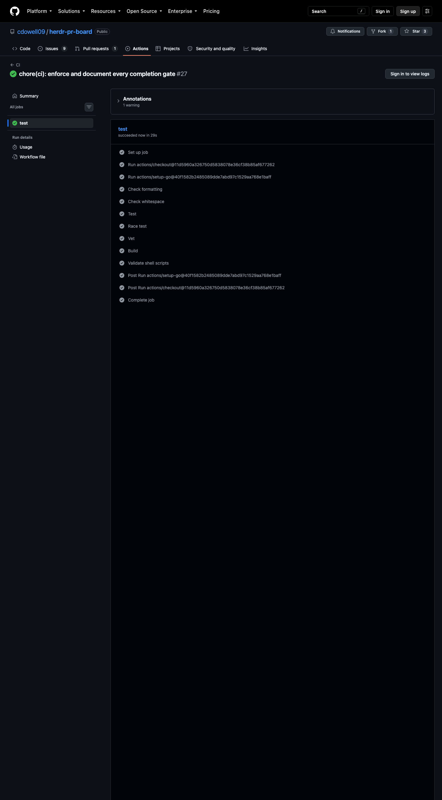

# herdr-pr-board

`herdr-pr-board` is a plugin for [Herdr](https://herdr.dev). It brings pull requests from multiple repositories and GitHub organizations into one Herdr tab.


## Terms

This document uses these technical terms:

- **View**: A named list of PRs from one GitHub search.
- **Scope**: A GitHub user, organization, or repository.

## Functions

The plugin supplies these default views:

- **Opened by me** shows each open PR that your GitHub account created.
- **Review requested** shows each open PR that requests your review.
- **All open** shows each open PR in the configured scopes.

You can add, remove, rename, or move views in `config.toml`.

The board shows the URL of the selected PR.

The CI column uses a symbol and a color:

| Symbol | Color | Meaning |
| --- | --- | --- |
| `✓` | Green | All checks passed. |
| `●` | Yellow | One or more checks are pending. |
| `✗` | Red | One or more checks failed. |
| `–` | Dim | The PR has no checks. |
| `?` | Dim | The plugin cannot get the check status. |

The **REV** column uses the same symbols for local PR Board reviews:

| Symbol | Meaning |
| --- | --- |
| `✓` | The current revision has a completed local review. |
| `●` | A review is running, queued, waiting for a slot, or awaiting dispatch. |
| `✗` | The current revision has a failed, blocked, or abandoned review. |
| `–` | No local review is active or complete for this revision. |
| `?` | Local review status or the current revision is unavailable. |

Select a PR to read its full review status below the URL.
Local status updates each second without GitHub requests.

The **POSTED** column shows submitted reviews from your authenticated GitHub account:

| Label | Meaning |
| --- | --- |
| `GitHub` | Reviews posted outside this PR Board installation. |
| `PR Board` | Reviews matched to this installation's publication records. |
| `Both` | Both sources have submitted reviews. |
| `–` | No submitted reviews were found. |
| `?` | Review history, publication origin, or a publication outcome is uncertain. |

The selected detail shows whether each source has a review on the current head.
Otherwise, it identifies older reviews or an unknown revision.
A newer commit does not inherit a completed local review.
Draft reviews and ordinary PR conversation comments do not count as submitted reviews.
Dismissed reviews still count as posts. The column does not represent approval status.
`GitHub` identifies the publication source. It does not prove that a human wrote the review.
A review started with `n` is still a PR Board review.
Open `v` for local findings and publication diagnostics.
GitHub review observations follow the normal refresh interval and cache.
Restart a monitor from an earlier version to load GitHub review observations after this upgrade.

## Requirements

Install these tools:

- Herdr 0.8.0 or later
- GitHub CLI (`gh`)
- Go 1.24 or later

The plugin supports macOS and Linux.
Local reviews also require a configured reviewer program.
See [manual reviews](docs/reviews.md) for reviewer requirements.

Authenticate GitHub CLI before you use the plugin:

```sh
gh auth login
```

The plugin does not store a GitHub token. GitHub CLI supplies the authentication. GitHub CLI reads `GH_TOKEN` and `GITHUB_TOKEN` before its stored login.

## Install from GitHub

Run this command:

```sh
herdr plugin install cdowell09/herdr-pr-board
```

## Use a local source build

Use this procedure to test the current checkout instead of the GitHub version.

Build and link the plugin:

```sh
go build -o bin/herdr-pr-board ./cmd/herdr-pr-board
herdr plugin link "$PWD" --enabled
```

`herdr plugin link` registers this checkout as `cdowell09.pr-board`. It does not copy the source files. The linked plugin runs `bin/herdr-pr-board` from this checkout. Herdr preserves the existing configuration and runtime state.

Verify the local link:

```sh
herdr plugin list --plugin cdowell09.pr-board --json
```

The link is ready when all these conditions are true:

- `source.kind` is `local`
- `plugin_root` points to this checkout
- `enabled` is `true`

If the board is open, press `q` first.
The open action focuses an existing board.
The action does not rebuild a running board.

Open the source build:

```sh
herdr plugin action invoke open --plugin cdowell09.pr-board
```

Rebuild the binary after each source change.

Return to the GitHub version:

```sh
herdr plugin unlink cdowell09.pr-board
herdr plugin install cdowell09/herdr-pr-board
```

`herdr plugin unlink` removes the local registration. It preserves the configuration and runtime state.

## Release the plugin

Maintainers must follow the [release guide](docs/releasing.md).
The release workflow validates the tag against `herdr-plugin.toml`.
The release contains source only.
See [CHANGELOG.md](CHANGELOG.md) for release changes.
The release workflow uses `git-cliff` to generate release notes from commit history.

## Open the board

Run this command:

```sh
herdr plugin action invoke open --plugin cdowell09.pr-board
```

The action opens a dedicated Herdr tab named `PR Board`. If the tab is open, the action moves focus to that tab.

You can add this key binding to `~/.config/herdr/config.toml`:

```toml
[[keys.command]]
key = "prefix+shift+b"
type = "plugin_action"
command = "cdowell09.pr-board.open"
description = "open PR board"
```

Reload the Herdr configuration:

```sh
herdr server reload-config
```

The default Herdr prefix is `Ctrl+B`. Press `Ctrl+B`, and then press `Shift+B` to open the board.

The shortcut does not replace `prefix+shift+p`. Herdr uses that shortcut to rename a pane.

## Retrieve a JSON snapshot

Scan all configured views without a terminal or Herdr:

```sh
bin/herdr-pr-board --json
```

Scan one configured view with an explicit configuration:

```sh
bin/herdr-pr-board --json --view review --config path/to/config.toml
```

Each invocation attempts a fresh scan.
The command emits one versioned JSON document on standard output.
Diagnostics use standard error.
The result includes revision identity, CI, submitted reviews, observation times, limits, rates, and structured errors.
Submitted reviews come from the authenticated GitHub account.
The JSON snapshot does not include local review findings or publication records.
Unavailable metadata uses `null`.
Result completeness remains unknown, even when Search succeeds.
Partial results preserve available rows and produce exit status `1`.
Invalid command usage produces exit status `2`.
The scan has a 90-second timeout and supports cancellation.

See the [version-one JSON contract](docs/json-snapshots.md) for field definitions and failure behavior.

## Monitor without a board

The board starts a background monitor when saved settings select automatic views and enable repository automatic launches.
The board checks these settings when it opens, after successful settings saves, and after configuration reloads.
It reuses an existing monitor in the same state directory.
Closing the board leaves the monitor running.
Startup does not change review or publication permissions.

Run a foreground monitor without opening the board:

```sh
export HERDR_PLUGIN_STATE_DIR="/absolute/path/to/plugin-state"
bin/herdr-pr-board --monitor
```

The state directory must use an absolute path.
The monitor runs until you send `Ctrl+C` or `SIGTERM`.
Closing the board does not stop the monitor.
Only one monitor can use a state directory.
A crashed monitor releases ownership automatically.
Reopen the board, save settings, or reload configuration to retry a stopped background monitor.
The board does not continuously restart crashed monitors.
The plugin does not install an operating-system startup service.

Background diagnostics use the private `monitor.log` file in `HERDR_PLUGIN_STATE_DIR`.
The log retains its first 1 MiB and discards further output.
Each new background launch resets the log.
Startup failures appear in the board.
Use the displayed foreground command if background startup fails.

The monitor scans all views immediately.
It then uses `github.refresh_interval` between completed scans.
With `"0"`, it scans once and waits until stopped.
The monitor writes each observation atomically to `monitor-snapshot.json` in the state directory.
This internal file is not the public JSON contract.

Boards with the same state directory read monitor observations each second.
They do not schedule additional GitHub scans while the monitor runs.
An unchanged observation does not renew sidebar tokens.
Failed observations preserve errors and actual observation times.
An open board retains its previous successful rows after failed searches.
Monitor ownership does not mean that its observation is current.
The board resumes independent refreshes when the monitor stops.

Manual refreshes and `--json` still attempt fresh scans.
They wait for other scans in the same state directory.
Waiting uses the command's existing timeout.
A one-shot scan does not replace the monitor observation.
Commands without `HERDR_PLUGIN_STATE_DIR` keep independent refresh behavior.

Use the same discovery configuration for the monitor and board.
After changing views or GitHub settings, restart the monitor with the updated configuration.
A configuration mismatch shows an error instead of starting duplicate scheduled scans.
Automatic reviews remain disabled until you select views and enable repository launches.
See [automatic reviews](docs/automatic-reviews.md) for dispatch, eligibility, and optional publication.

## Configure the board

The first run creates this file:

```text
$(herdr plugin config-dir cdowell09.pr-board)/config.toml
```

See [`config.example.toml`](config.example.toml) for a complete example.

The default configuration has this structure:

```toml
[ui]
title = "Pull Requests"

[github]
refresh_interval = "5m"
limit_per_scope = 100
max_concurrency = 4
ci_batch_size = 25
scopes = [
  "user:@me",
  # "org:your-company",
  # "repo:owner/repository",
]

[[views]]
id = "authored"
title = "Opened by me"
query = "is:open author:@me"
scope = "global"

[[views]]
id = "review"
title = "Review requested"
query = "is:open review-requested:@me"
scope = "global"

[[views]]
id = "all"
title = "All open"
query = "is:open"
scope = "configured"

[sidebar]
enabled = true
ttl = "15m"
review_view = "review"

[review]
auto_views = []
max_concurrency = 1
timeout = "30m"
```

Each view uses a GitHub PR search query.

`scope = "global"` runs the query one time. `scope = "configured"` runs the query one time for each configured scope.

The plugin runs the scope searches at the same time. `github.max_concurrency` limits the number of Search API requests that run at the same time.

The plugin combines the scoped results. The plugin removes duplicate PR URLs.

### Settings reference

| Setting | Default | Valid values | Effect |
| --- | --- | --- | --- |
| `ui.title` | `"Pull Requests"` | A string that is not empty. | The header of the board. |
| `github.refresh_interval` | `"5m"` | `"0"` or a Go duration of `1m` or more, for example `"5m"` or `"1h"` | The time between automatic refreshes. `"0"` stops automatic refresh. |
| `github.limit_per_scope` | `100` | An integer from 1 through 1000 | The maximum number of PRs that each search query returns. |
| `github.max_concurrency` | `4` | An integer from 1 through 8 | The maximum number of Search API requests that the plugin sends at the same time across all views and scopes during a refresh. |
| `github.ci_batch_size` | `25` | An integer from 1 through 50 | The number of PRs in one GraphQL metadata query. |
| `github.scopes` | `["user:@me"]` | Each entry must be `user:name`, `org:name`, or `repo:owner/name`. Each entry must be unique. Configured views require at least one scope. | The scopes that views with `scope = "configured"` use. `@me` refers to your GitHub account. |
| `[[views]].id` | None | Lowercase letters, digits, `-`, and `_`. The ID must start with a letter. Each ID must be unique. | The ID of the view. |
| `[[views]].title` | None | A string that is not empty. | The name of the view in the board. |
| `[[views]].query` | None | A GitHub PR search that is not empty. | The PRs that the view shows. |
| `[[views]].scope` | None | `"global"` or `"configured"` | `"global"` runs the query one time. `"configured"` runs the query one time for each entry in `github.scopes`. |
| `sidebar.enabled` | `true` | `true` or `false` | Report PR counts into Herdr sidebar tokens after each full refresh. |
| `sidebar.ttl` | `"15m"` | `"0"` or a Go duration of `1m` or more, for example `"15m"` or `"1h"` | How long the reported tokens stay visible after the last report. `"0"` keeps the tokens until the next report. |
| `sidebar.review_view` | `"review"` | Lowercase letters, digits, `-`, and `_`. The value must start with a letter. | The view whose PR count reports as the `$prs_review` token. When no view has this ID, the plugin omits the token. |
| `review.auto_views` | `[]` | Unique configured view IDs | The views that supply automatic review candidates. An empty list disables automatic reviews. |
| `review.max_concurrency` | `1` | An integer from 1 through 8 | The shared limit for simultaneous manual and automatic reviews in one state directory. |
| `review.timeout` | `"30m"` | A Go duration from `"1s"` through `"24h"` | The review timeout, including queue time and execution time. |

Reviewer commands and repository permissions require separate configuration.
See [manual reviews](docs/reviews.md) and [repository setup and publication](docs/repository-publication.md) for those settings.

When the board starts, it makes sure that the configuration is correct. If the configuration has a mistake, the board does not start. The error message gives the name of the setting that is wrong.

### Validate your configuration

Run this command to check a configuration. The command does not start the board:

```sh
bin/herdr-pr-board -config path/to/config.toml -validate
```

If the configuration is correct, the command prints `configuration is valid` and exits with code 0. If the configuration has a mistake, the command prints the problem and exits with a non-zero code. The command does not create a missing file. The command does not need GitHub CLI.

### Add a custom view

Add another `[[views]]` section:

```toml
[[views]]
id = "security"
title = "Security queue"
query = 'is:open label:"security" -is:draft'
scope = "configured"
```

Use a unique lowercase `id`. Use a GitHub PR search for `query`.

### Stop automatic refresh

Set the refresh interval to zero:

```toml
[github]
refresh_interval = "0"
```

## Show PR counts in the Herdr sidebar

The board reports PR counts into Herdr sidebar tokens after each full refresh.
It reports the tokens only to the Herdr workspace that runs the board.
The reporting reuses the refresh snapshot. It makes no extra GitHub requests.

The board reports after the initial refresh, after each automatic refresh, and after a manual full refresh (`R`). It does not report after an active-view refresh (`r`).

The sidebar shows the tokens only when you add them to the Herdr configuration.
Add a row to the space entries in `~/.config/herdr/config.toml`:

```toml
[ui.sidebar.spaces]
rows = [
  ["state_icon", "workspace"],
  ["branch", "git_status"],
  ["$prs_open", "$prs_review", "$prs_ci"],
]
```

Reload the Herdr configuration:

```sh
herdr server reload-config
```

The board reports these tokens:

| Token | Example value | Meaning |
| --- | --- | --- |
| `$prs_open` | `12 open` | The number of distinct pull requests on the board. |
| `$prs_review` | `3 review` | The number of pull requests in the `sidebar.review_view` view. |
| `$prs_ci` | `2 fail` | The number of distinct pull requests with a failed check. |

The board omits `$prs_ci` when no check failed. It omits `$prs_review` when no view has the configured ID. The board does not report after a refresh with a failed view. It keeps the previous tokens until they expire.

The tokens appear under the workspace that runs the board.
With a nonzero `sidebar.ttl`, tokens expire after the last report.
Closing the board stops reports.
With `sidebar.ttl = "0"`, closing the board does not expire tokens.
The headless monitor does not report workspace tokens.
The board reports tokens only when Herdr starts it. When you run the binary directly, the board does not report.

You can style each token with an inline style table, for example:

```toml
rows = [["state_icon", "workspace"], ["$prs_open", "$prs_review", { token = "$prs_ci", fg = "#f38ba8" }]]
```

The reporting needs the `herdr` command on `PATH`. The board must run inside Herdr. When the command fails, the board shows one warning in the footer. The board stays usable.

## Use the board

| Key | Action |
| --- | --- |
| Left click a view | Select the view. |
| Left click a PR | Select the PR. |
| Left click the URL | Open the PR in a browser. |
| Mouse wheel | Move through the PR list. |
| `1`–`9` | Select a view. |
| `Tab`, `Shift+Tab`, `h`, `l`, `←`, `→` | Select the next or previous view. |
| `j`, `k`, `↑`, `↓` | Select a PR. |
| `g`, `Home` | Select the first PR. |
| `G`, `End` | Select the last PR. |
| `/` | Start filter input. |
| `Enter` | Finish filter input. |
| `Backspace` | Remove the last filter character. |
| `Ctrl+U`, `Esc` | Clear the filter. |
| `E` | Edit the active configuration. |
| `v` | Open local reviews for the selected PR. |
| `r` | Refresh the active view. |
| `R` | Refresh all views. |
| `Enter`, `o` | Open the selected PR in a browser. |
| `q`, `Ctrl+C` | Close the board. |

The board sorts PRs by update time, with the most recent first.
The filter matches repository names, titles, authors, and PR numbers.
The filter ignores letter case and makes no GitHub requests.

Press `E` to edit the active configuration while the board runs. The board uses `$VISUAL`, `$EDITOR`, or `vi`.
It validates the file after the editor exits. It reloads valid changes and refreshes all views.
It keeps the previous configuration when the editor or validation fails.

If the operating system cannot open the browser, the board keeps the selected URL visible. It reports the failure at the bottom of the screen.

The footer pairs each keybinding with its action. On narrow terminals, the pairs wrap.


### Local review controls

Press `v` to open the selected PR's review history.
The first review action offers repository setup when no repository settings exist.
Use the arrow keys and Space to change settings.
Select global automatic view IDs explicitly in repository settings.
These view selections apply to all repositories that allow automatic launches.
The settings panel separates reviews, GitHub permissions, automatic posting, and global views.
Enable **Comments** under **GitHub permissions** to allow comments.
Permission alone does not enable automatic posting.
Select **After review: Post comment** under **Automatic posting** to post each newly completed review.
Select **After review: Keep local** to keep findings local.
The panel shows the monitor state and any missing setup requirement.
Use PgUp and PgDn to scroll through settings and the monitor command.
Successful saves start a stopped monitor when saved automatic views and repository launches are enabled.
Run the displayed command in another terminal if background startup fails.
New selections can take effect on the next monitor scan.
Press Enter to save, or Esc to discard changes.
Defaults keep launches manual and findings local.
The panel shows the latest review before previous reviews.
Each review shows its findings and publication outcomes together.
The latest completed review is the manual publication target.
The panel distinguishes current observed revisions from older revisions.
Scroll to Details for full run IDs, revisions, publication URLs, and diagnostics paths.
Automation status appears after review results.
Eligible PRs show **Waiting for review slot** when the running monitor has no available review slot.
The panel checks shared review slots each second.
Saved After review settings apply to newly completed manual reviews, explicit reruns, and monitor reviews.
Permission alone does not post reviews.
Changing settings does not publish earlier completed reviews.

| Key | Action in the review panel |
| --- | --- |
| `n` | Queue a review with the repository's configured reviewer. |
| `N` | Explicitly retry or repeat a review. |
| `s` | Edit repository settings. |
| `c` | Publish the latest completed run as a comment. |
| `a` | Publish the latest completed run as an approval. |
| `x` | Publish the latest completed run as a change request. |
| `j`, `k`, `↑`, `↓`, mouse wheel | Scroll through findings and diagnostics. |
| `g`, `Home`, `G`, `End` | Move to the first or last history line. |
| `o`, click the URL | Open the PR in a browser. |
| `Esc`, `v` | Return to the board. |
| `q`, `Ctrl+C` | Close the board and stop its review requests. |

Reviews continue when you close the panel.
Closing the board cancels its queued and active reviews.
The background monitor and its reviews continue.
The board remains responsive while reviews run.
The saved **After review** setting controls automatic posting.
Select **Keep local** to publish findings only with the manual controls.
Set `review.max_concurrency` in `config.toml` to allow more simultaneous reviews.
Use an integer from 1 through 8. The default is 1.
Manual reviews and automatic reviews share this limit.
The monitor reloads the limit after a review finishes or on the next scan.
See [manual reviews](docs/reviews.md) to configure a reviewer.
See [repository setup and publication](docs/repository-publication.md) for permissions, CLI configuration, and failure recovery.

### Layouts

The board adapts to the terminal width:

| Terminal width | Layout |
| --- | --- |
| 120 cells or more | All columns. |
| 100–119 cells | All columns with compact repository and author columns. |
| 80–99 cells | No author column. |
| 60–79 cells | No author or updated columns. |
| Fewer than 60 cells | PR, CI, REV, and title columns. |

The selected PR URL stays visible at every width.
The full review and posted details wrap below the URL.
The board truncates column text by terminal cell width.
Emoji, combining characters, and wide glyphs stay aligned.


## API limits

The plugin refreshes the board when it starts. The default automatic refresh interval is five minutes.

GitHub permits 30 authenticated Search API requests each minute. GitHub returns a maximum of 1,000 results for each search.

The plugin runs view and scope searches at the same time. `github.max_concurrency` limits the number of Search API requests that run at the same time. The plugin removes duplicate PRs before it requests CI data.

The plugin gets CI data and your submitted reviews with batched GraphQL queries.
It uses your cached GitHub login to filter review authors.
Restart the monitor after switching GitHub accounts.
Review histories with more than 100 entries require additional pages.
Each page checks the available GraphQL capacity before it runs.
GitHub gives an authenticated user 5,000 GraphQL points each hour.
The plugin keeps complete metadata results for two minutes.
A refresh inside that time uses the kept result without another GraphQL query for that PR.
Failed or incomplete review observations retry on the next refresh.

The board shows the remaining Search API and GraphQL capacity. The board keeps old data when a refresh fails.

The footer reports when the active view last refreshed successfully. A failed refresh does not advance that time. When a refresh fails, the footer marks the view as `stale`. The board keeps old data. A `stale` notice above the table counts the retained rows until a refresh succeeds.

## Troubleshooting and plugin lifecycle

See [`docs/troubleshooting.md`](docs/troubleshooting.md) for help with common failures. It also explains how install, configuration, upgrades, and removal affect plugin files.

## Develop the plugin

Read [`CONTRIBUTING.md`](CONTRIBUTING.md) before you contribute. Report security problems through GitHub private vulnerability reporting. See [`SECURITY.md`](SECURITY.md).

Run these checks from the repository root:

```sh
gofmt -w cmd internal
go test ./...
python3 -B -m unittest discover -s scripts -p '*_test.py'
go vet ./...
go run honnef.co/go/tools/cmd/staticcheck@v0.6.1 ./...
go test -race ./...
go build -o bin/herdr-pr-board ./cmd/herdr-pr-board
bash -n bin/open bin/run
git diff --check
```

CI checks pull requests and `main`.
It also validates release tooling and builds each supported platform:



Herdr runs each plugin command from the plugin directory. Store user configuration in `HERDR_PLUGIN_CONFIG_DIR`.

Store runtime state in `HERDR_PLUGIN_STATE_DIR`. Do not store user data in `HERDR_PLUGIN_ROOT`.

See [local review memory](docs/review-memory.md) for the shared history and claim contract.
See [manual reviews](docs/reviews.md) for reviewer configuration, commands, and panel controls.
