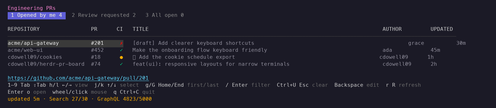
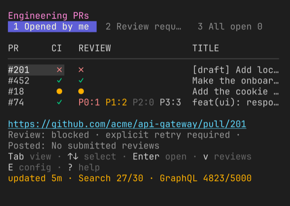
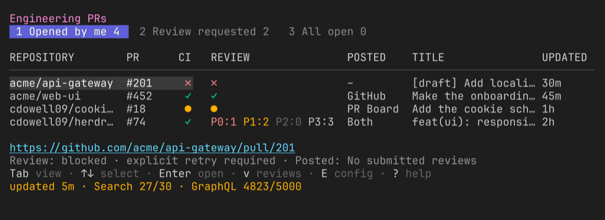

# Board controls and status

The plugin supplies these default views:

- **Opened by me** shows each open PR that your GitHub account created.
- **Review requested** shows each open PR that requests your review.
- **All open** shows each open PR in the configured scopes.

You can add, remove, rename, or move views in `config.toml`.

The board shows the URL of the selected PR.

The CI column uses a symbol and a color:

| Symbol | Color | Meaning |
| --- | --- | --- |
| `✓` | Green | All checks passed. |
| `●` | Yellow | One or more checks are pending. |
| `✗` | Red | One or more checks failed. |
| `–` | Dim | The PR has no checks. |
| `?` | Dim | The plugin cannot get the check status. |

The **REV** column uses the same symbols for local PR Board reviews:

| Symbol | Meaning |
| --- | --- |
| `✓` | The current revision has a completed local review. |
| `●` | A review is running, queued, waiting for a slot, or awaiting dispatch. |
| `✗` | The current revision has a failed, blocked, or abandoned review. |
| `–` | No local review is active or complete for this revision. |
| `?` | Local review status or the current revision is unavailable. |

Select a PR to read its full review status below the URL.
Local status updates each second without GitHub requests.

The **POSTED** column shows submitted reviews from your authenticated GitHub account:

| Label | Meaning |
| --- | --- |
| `GitHub` | Reviews posted outside this PR Board installation. |
| `PR Board` | Reviews matched to this installation's publication records. |
| `Both` | Both sources have submitted reviews. |
| `–` | No submitted reviews were found. |
| `?` | Review history, publication origin, or a publication outcome is uncertain. |

The selected detail shows whether each source has a review on the current head.
Otherwise, it identifies older reviews or an unknown revision.
A newer commit does not inherit a completed local review.
Draft reviews and ordinary PR conversation comments do not count as submitted reviews.
Dismissed reviews still count as posts. The column does not represent approval status.
`GitHub` identifies the publication source. It does not prove that a human wrote the review.
A review started with `n` is still a PR Board review.
Open `v` for local findings and publication diagnostics.
GitHub review observations follow the normal refresh interval and cache.

## Controls

| Key | Action |
| --- | --- |
| Left click a view | Select the view. |
| Left click a PR | Select the PR. |
| Left click the URL | Open the PR in a browser. |
| Mouse wheel | Move through the PR list. |
| `1`–`9` | Select a view. |
| `Tab`, `Shift+Tab`, `h`, `l`, `←`, `→` | Select the next or previous view. |
| `j`, `k`, `↑`, `↓` | Select a PR. |
| `g`, `Home` | Select the first PR. |
| `G`, `End` | Select the last PR. |
| `/` | Start filter input. |
| `Enter` | Finish filter input. |
| `Backspace` | Remove the last filter character. |
| `Ctrl+U`, `Esc` | Clear the filter. |
| `E` | Edit the active configuration. |
| `v` | Open local reviews for the selected PR. |
| `r` | Refresh the active view. |
| `R` | Refresh all views. |
| `Enter`, `o` | Open the selected PR in a browser. |
| `q`, `Ctrl+C` | Close the board. |

The board sorts PRs by update time, with the most recent first.
The filter matches repository names, titles, authors, and PR numbers.
The filter ignores letter case and makes no GitHub requests.

Press `E` to edit the active configuration while the board runs.
The board uses `$VISUAL`, then `$EDITOR`.
The fallback editor is Notepad on Windows and `vi` on macOS and Linux.
It validates the file after the editor exits. It reloads valid changes and refreshes all views.
It keeps the previous configuration when the editor or validation fails.

The board reports browser failures at the bottom of the screen.
The selected URL stays visible for manual copying.

The footer pairs each keybinding with its action. On narrow terminals, the pairs wrap.



See [manual reviews](reviews.md) for review controls, cancellation, and result history.

## Open the board with a shortcut

Run this command:

```sh
herdr plugin action invoke open --plugin cdowell09.pr-board
```

The action opens a dedicated tab named `PR Board`.
If the tab is open, the action focuses that tab.

You can add this key binding to `~/.config/herdr/config.toml`:

```toml
[[keys.command]]
key = "prefix+shift+b"
type = "plugin_action"
command = "cdowell09.pr-board.open"
description = "open PR board"
```

Reload the Herdr configuration:

```sh
herdr server reload-config
```

The default Herdr prefix is `Ctrl+B`. Press `Ctrl+B`, and then press `Shift+B` to open the board.

The shortcut does not replace `prefix+shift+p`. Herdr uses that shortcut to rename a pane.

## Layouts

The board adapts to the terminal width:

| Terminal width | Layout |
| --- | --- |
| 120 cells or more | All columns. |
| 100–119 cells | All columns with compact repository and author columns. |
| 80–99 cells | No author column. |
| 60–79 cells | No author or updated columns. |
| Fewer than 60 cells | PR, CI, REV, and title columns. |

The selected PR URL stays visible at every width.
The full review and posted details wrap below the URL.
The board truncates column text by terminal cell width.
Emoji, combining characters, and wide glyphs stay aligned.






